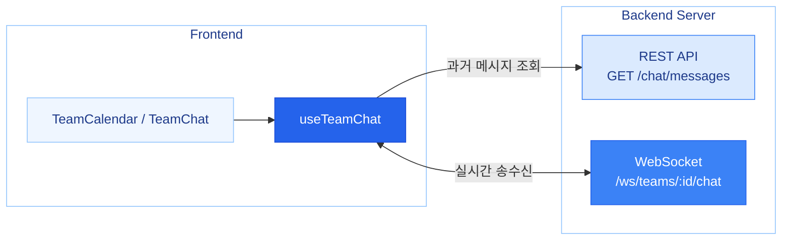
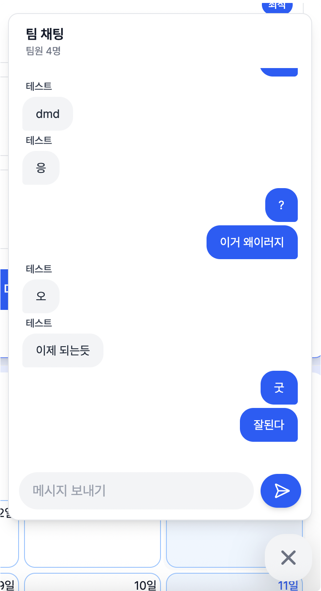

## 🧑🏻‍💻 대학생을 위한 팀 일정 관리 매니저, UniSchedule

🏆 **카카오 테크 캠퍼스 최종 프로젝트 우수상(2위)**

>대학생들의 복잡한 팀 프로젝트와 개인 일정을 한 번에 관리해주는 대학생 맞춤형 일정 관리 서비스

조별 과제, 동아리, 스터디 등 팀 활동에 최적화된 기능을 제공하여 일정 조율의 효율을 높이고 커뮤니케이션 비용을 절감하는 것을 목표로 합니다.<br>
**React와 TailwindCSS** 기반 UI으로 **FullCalendar 및 RRule**로 일정/반복 일정을 구현하고, **WebSocket**으로 실시간 팀 채팅을 제공합니다.


## ✨ 주요 기능

### WebSocket 기반 실시간 팀 채팅

https://github.com/user-attachments/assets/5d3d6724-2ce2-4ab8-8160-878885b7e039




> [!NOTE]
> 채팅 기능은 **네이티브 WebSocket**을 활용해 실시간 메시지를 송수신하고, **REST API**를 통해 기존 대화 내역을 조회하도록 구현했습니다.
> 채팅 관련 로직은 **`useTeamChat` 커스텀 훅**으로 분리하였습니다.

## ✨ 기능 구현

### 1. FullCalendar · RRule 기반 일정 관리

https://github.com/user-attachments/assets/59ea2ba3-28a9-450a-b17e-1b5892c6fe0f

> [!NOTE]
> **FullCalendar**를 기반으로 단일 일정과 반복 일정을 관리할 수 있도록 구현했으며, **RRule**을 활용해 백엔드와 함께 반복 규칙을 정의하고 예외 일정을 처리했습니다.

### 2. WebSocket 기반 실시간 팀 채팅

<p align="center">
  
</p>

> [!NOTE]
> 채팅 기능은 **네이티브 WebSocket**을 활용해 실시간 메시지를 송수신하고, **REST API**를 통해 기존 대화 내역을 조회하도록 구현했습니다.
> 채팅 관련 로직은 **`useTeamChat` 커스텀 훅**으로 분리하였습니다.

### 3. 에브리타임 시간표 연동

https://github.com/user-attachments/assets/6da9f127-6620-43d8-8c7a-f663d967ed8a

> [!NOTE]
> **에브리타임 시간표 이미지 또는 에브리타임 시간표 공유 링크를 업로드해 일정에 연동**할 수 있도록 구성했습니다.

### 4. 반응형 레이아웃

> [!NOTE]
> 프로젝트의 중간 점검 단계였던 아이디어톤에서 현직자 기획 멘토님으로부터 **캘린더 서비스라면 모바일 환경도 고려해야 한다**라는 피드백을 받았습니다.
> 피드백을 반영하기로 결정하여 **즉시 개발 방향을 수정**했고, 반응형 레이아웃을 적용해 모바일과 태블릿 환경에서도 사용할 수 있도록 UI/UX를 개선했습니다.

### 5. 로그인

https://github.com/user-attachments/assets/80f2cee6-a204-4510-a355-7c4a50f43dc7

### 전체 시연 영상

🎬 [전체 시연 영상](https://drive.google.com/file/d/1Kyhudr9JqhYTI_yAzuZxC_IdD2Ho9BmP/view?usp=drive_link)

---

## 🛠 기술 스택

### 💻 Frontend Toolkit


### 🎨 Styling


### 🔄 State Management


### 📚 Key Libraries


### 🛠 Development Tools


### 🧩 Cowork Tools


---

## 🚀 시작하기

### 필수 요구사항
- Node.js 18.0.0 이상
- npm 또는 yarn

### 설치 및 실행

```bash
git clone <repository-url>
cd Team12_FE
npm install
npm run dev
```

개발 서버는 기본적으로 `http://localhost:3000`에서 실행됩니다.

### 환경 변수

프로젝트 루트에 `.env` 파일을 생성하고 필요한 환경 변수를 설정하세요:

```env
VITE_API_BASE_URL=http://localhost:8080
VITE_WS_URL=ws://localhost:8080
```

### 프로젝트 스크립트

```bash
npm run dev          # 개발 서버 실행
npm run build        # 프로덕션 빌드
npm run preview      # 빌드 미리보기
npm run lint         # 코드 린팅
npm run format       # 코드 포맷팅
npm run format:check # 포맷팅 검사
```

---

## 📁 프로젝트 구조

```
src/
├── apis/
│ ├── client/
│ ├── constants/ # API 엔드포인트 상수
│ ├── services/
│ │ ├── auth.ts # 인증 API
│ │ ├── calendar.ts # 캘린더 API
│ │ ├── chat.ts # 채팅 API
│ │ ├── team.ts # 팀 API
│ │ └── everytime.ts # 에브리타임 시간표 연동 API
│ └── types/
├── assets/
├── components/
│ ├── atoms/ # 버튼, 인풋, 로고
│ ├── molecules/ # 모달, 페이지네이션
│ └── organisms/ # 헤더, 드로어
├── hooks/
│ ├── calendar/
│ ├── team/
│ ├── timetable/
│ └── modal/
├── layout/
├── lib/
│ ├── queryClient.ts # React Query 클라이언트 설정
│ └── queryKeys.ts # React Query 키 관리
├── pages/
│ ├── Calendar/ # 공통 캘린더 컴포넌트
│ ├── PersonalCalendar/
│ ├── TeamCalendar/
│ ├── TimeTable/
│ ├── Login/
│ └── Signup/
├── routes/
│ ├── index.tsx
│ └── path.ts
├── store/ # 전역 상태 관리(Zustand)
│ ├── calendar/
│ ├── team/
│ └── useAuthStore.ts
├── types/
├── utils/ # 유틸리티 함수
│ ├── dateTimeUtils.ts # 날짜/시간
│ ├── eventUtils.ts # 이벤트
│ ├── rruleUtils.ts # RRULE
│ └── timetableUtils.ts # 시간표
├── styles/
├── App.tsx
├── main.tsx
└── index.css
```

---

## 🎯 프로젝트 배경

### 국내외 시장 현황 및 문제점

- 기존 캘린더 서비스의 한계
  - **Google 캘린더**
    - 팀원 간의 실질적인 공통 가용 시간을 파악하기 위해 복잡한 공유 설정이 필요합니다. 특히, 팀 공유 기능은 유료 Workspace 구독이 필요해 접근성이 낮습니다.
  - **When2Meet 등 일회성 일정 조율 도구**
    - 일회성 조율 도구는 지속적인 일정 관리가 어렵고 캘린더 기능이 부족합니다.

### 필요성과 기대효과

대학생들에게 비용 부담이 낮고 접근성이 좋으며, 지속적인 일정 관리가 가능한 맞춤형 서비스가 필요합니다.

본 서비스에서는 개인 캘린더 및 팀 캘린더 기능을 함께 제공하고, 에브리타임 시간표 및 Google 캘린더 연동을 지원해서 일정 관리 편의성을 높였습니다.

팀원들의 가용 시간을 자동으로 분석하고 최적의 회의 시간을 추천함으로써, 일정 조율에 필요한 커뮤니케이션 비용을 크게 줄일 수 있을 것으로 기대합니다.

---

## 🎯 개발 목표

> 목표

- 개인 일정과 팀 일정을 통합 관리하는 직관적인 캘린더 UI 구축
- 팀원 간 가용 시간 조회를 통한 최적 일정 추천 기능 제공
- 개인 일정 내용 노출 방지(사생활 보호)를 위한 UI/UX 설계
- 에브리타임 시간표, Google 캘린더 등 외부 일정 연동 기능 제공

### 기존 서비스 대비 차별성

| 주요 기능 | Google Calendar | When2Meet | Notion | UniSchedule |
| :--- | :--- | :--- | :--- | :--- |
| 수업 일정 등록 | 매 학기 수동 등록 | 기능 없음 | 수동 등록 | 에브리타임 연동 |
| 팀원 일정 확인 | 모든 캘린더 공유/초대 필요 | 가능한 시간 투표 | 구글 캘린더 공유 필요 | 팀 생성/참여 및<br>팀원 가용 시간 확인 가능 |
| 프라이버시 | 일정 공개 여부 선택 가능 | 익명 투표 | 일정 공개 여부 선택 불가능 | 시간만 공유 |
| 팀 일정 등록 | 유료 Workspace 사용 필요 | 미제공 | 구글 캘린더 의존 | 팀 내 메신저 및<br>팀 일정 등록 가능 |

---

## 🧭 라우터 구조

```typescript
export const RouterPath = {
  HOME: {
    DEFAULT: '/',
    VIEW: '/:view/:date',
  },
  TEAM_CALENDAR: {
    DEFAULT: '/team-calendar/:id',
    VIEW: '/team-calendar/:id/:view/:date',
  },
  TIMETABLE: '/timetable',
  LOGIN: '/login',
  SIGNUP: '/signup',
};
```

---

## 📏 코딩 컨벤션

### 파일 명명 규칙
- **컴포넌트**: PascalCase (예: `UserProfile.tsx`)
- **훅**: camelCase + use 접두사 (예: `useAuth.ts`)
- **유틸리티**: camelCase (예: `formatDate.ts`)
- **상수**: UPPER_SNAKE_CASE (예: `API_ENDPOINTS`)

### 컴포넌트 구조
- **Atomic Design 패턴**: atoms, molecules, organisms로 컴포넌트 계층화
- **커스텀 훅**: 재사용 가능한 로직은 커스텀 훅으로 분리
- **타입 정의**: TypeScript를 활용한 타입 안전성 보장

### Git 컨벤션
- `feat`: 새로운 기능 추가
- `fix`: 버그 수정
- `docs`: 문서 수정
- `style`: 코드 포맷팅, 세미콜론 누락 등
- `refactor`: 코드 리팩토링
- `test`: 테스트 코드 추가
- `chore`: 빌드 과정 또는 보조 도구 변경
